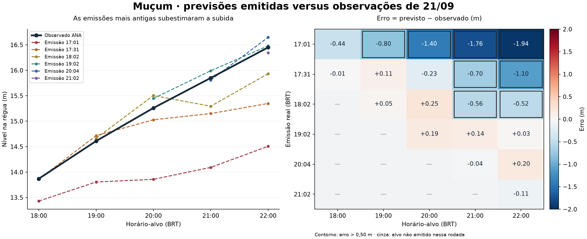

# Assertividade das previsões de Muçum — 21/09/2026

Corte da auditoria: **22h25min26s BRT**. A resposta pública da ANA foi capturada às **22h24min37s** e contém **16,45 m às 22h**, com `CQ_NivelFinal = Dado aprovado`, estação **86510000**. Todos os horários deste documento são BRT. Esta análise preserva as previsões originais e não publica nem retreina modelos.

A automação local teve **12 acertos e 8 erros em 20 previsões verificáveis: 60,0%**. Limitando a pelo menos uma hora real de antecedência: **6/14 = 42,9%**. O agregado reúne versões históricas e serve para descrever as emissões observadas; não é a precisão de uma versão única nem do modelo congelado do site.



**Definição do cálculo.** O projeto já adotava erro absoluto de até **0,50 m**. A tolerância não foi escolhida depois de olhar os resultados.

```text
erro_i = previsão_i − observação_i
acerto_i = |erro_i| ≤ 0,50 m
assertividade = 100 × acertos / pares verificáveis
MAE = média(|erro|)
viés = média(erro)             # negativo: subestimação
RMSE = raiz(média(erro²))
antecedência real = horário-alvo − horário real da emissão
```

O erro é classificado antes de arredondar. Previsão e medição precisam coincidir na estação e no horário exato. Leituras ausentes, suspeitas ou futuras não viram acertos; nenhuma interpolação ou repetição da última leitura foi usada. P90/P98 usam quantis amostrais com interpolação linear e são descritivos, não limites garantidos. Não usamos “100 menos erro percentual do nível”: a régua tem referência própria e essa conta não mede a proporção de previsões corretas.

**Resultados por antecedência real — emissões programadas locais.** Uma previsão emitida às 21h02 para as 22h tem menos de uma hora restante, mesmo que o horizonte nominal seja 1h.

| Grupo | Verificáveis | Acertos | Erros | Taxa | MAE (m) | Viés (m) |
|---|---:|---:|---:|---:|---:|---:|
| <1 h | 6 | 6 | 0 | 100,0% | 0,139 | -0,059 |
| 1–<2 h | 5 | 4 | 1 | 80,0% | 0,299 | -0,022 |
| 2–<3 h | 4 | 2 | 2 | 50,0% | 0,555 | -0,540 |
| 3–<4 h | 3 | 0 | 3 | 0,0% | 0,991 | -0,991 |
| 4–<5 h | 2 | 0 | 2 | 0,0% | 1,522 | -1,522 |

Ainda não existem pares vencidos verificáveis com cinco horas ou mais de antecedência real nesta amostra. Ao todo há **97 pontos emitidos**, dos quais **20 verificáveis** e **77 ainda futuros**; nenhuma falta de medição entre os 20 vencidos. São **cinco horários-alvo únicos** (18h a 22h) e **seis emissões com alvos vencidos**. As previsões repetidas para o mesmo horário não representam novos eventos independentes.

No agregado: MAE **0,528 m**, RMSE **0,780 m**, viés **-0,432 m**, P90 **1,437 m**, P98 **1,872 m**, maior erro **1,942 m**. Das 20 diferenças, 13 são negativas e 7 positivas. **As oito falhas fora de ±0,50 m são negativas.** Todos os alvos medidos superam 7 m; o recorte de cheia coincide com esta amostra, sem certificar um conjunto de eventos independentes.

Sensibilidade à tolerância: ±0,20 m → **9/20 = 45%**; ±0,50 m → **12/20 = 60%**; ±1,00 m → **16/20 = 80%**. A régua principal continua ±0,50 m.

**Resultados por emissão real.** A emissão das 17h01 é a rodada nominal das 16h, concluída depois das 17h. A revisão manual das 18h35 está fora desta tabela.

| Grupo | Verificáveis | Acertos | Erros | Taxa | MAE (m) | Viés (m) |
|---|---:|---:|---:|---:|---:|---:|
| 17:01:10 | 5 | 1 | 4 | 20,0% | 1,269 | -1,269 |
| 17:31:09 | 5 | 3 | 2 | 60,0% | 0,430 | -0,388 |
| 18:02:09 | 4 | 2 | 2 | 50,0% | 0,343 | -0,194 |
| 19:02:15 | 3 | 3 | 0 | 100,0% | 0,120 | 0,120 |
| 20:04:38 | 2 | 2 | 0 | 100,0% | 0,119 | 0,078 |
| 21:02:20 | 1 | 1 | 0 | 100,0% | 0,105 | -0,105 |

As rodadas das 19h, 20h e 21h tiveram 6/6 acertos nos alvos já vencidos, mas ainda têm alvos futuros. Esse recorte recente é descritivo: prazos menores, dados mais recentes e versões diferentes impedem concluir que houve melhora causal do modelo. A rodada das 22h começa a ser verificável no alvo das 23h.

**Versões locais distintas.** Os sufixos abaixo pertencem a `hourly-live-weather-v1`. Cada rodada preserva os hashes dos seus artefatos treinados; o sufixo identifica o código, não torna os ajustes de todas as rodadas idênticos.

| Grupo | Verificáveis | Acertos | Erros | Taxa | MAE (m) | Viés (m) |
|---|---:|---:|---:|---:|---:|---:|
| 2c265b53228f8345 | 6 | 6 | 0 | 100,0% | 0,117 | 0,068 |
| 5e5d62467a8ec22d | 9 | 5 | 4 | 55,6% | 0,391 | -0,301 |
| 6618f3723be5a3b3 | 5 | 1 | 4 | 20,0% | 1,269 | -1,269 |

A versão `fd40fd74e87486e7`, usada na rodada das 22h, ainda não tem alvo vencido. A revisão manual das 18h35 acertou 4/4 com MAE 0,167 m, separadamente. A importação histórica antiga errou 7/7 com MAE 2,569 m; não foi registrada prospectivamente e não integra a taxa principal. Nenhum resultado ruim foi apagado.

**Site publicado.** A API mantém a última revisão de cada rodada; isso não é o histórico completo de todas as emissões. A última revisão da rodada das 21h foi gerada às **21h54min17s**, previu **16,459804 m** às 22h e observou-se **16,45 m**: erro **+0,009804 m**, cerca de **0,98 cm**, com apenas **5min43s** de antecedência. É **1 acerto em 1 alvo**, não evidência de 100% de precisão geral e nem uma validação de 1h.

Duas versões públicas anteriores também estavam preservadas localmente. Elas permanecem separadas como revisões do mesmo alvo:

| Emissão do site | Alvo | Antecedência real | Previsto (m) | Observado (m) | Erro (m) |
|---|---|---:|---:|---:|---:|
| 21:19:00 | 22:00:00 | 41,00 min | 16,453721 | 16,45 | 0,003721 |
| 21:31:34 | 22:00:00 | 28,43 min | 16,494208 | 16,45 | 0,044208 |
| 21:54:17 | 22:00:00 | 5,71 min | 16,459804 | 16,45 | 0,009804 |

As três revisões acertaram, mas dizem respeito à mesma observação das 22h. Na última revisão de cada rodada, há 1 ponto verificável e 11 futuros. A amostra recuperada de revisões é incompleta, e não comprova disponibilidade de todas as execuções.

**Variante sem previsão de chuva.** Os seis valores calculados localmente às 22h19 para 23h–04h ainda não têm observação correspondente neste corte: **zero pares verificáveis; taxa não calculável**. Esse teste não foi emitido pelo registro prospectivo nem publicado. Portanto, os 60% acima não medem sua precisão. Retirar previsão meteorológica também não equivale a impor chuva futura zero.

**Cada falha programada, sem esconder os casos próximos da tolerância.** Erro negativo significa que o rio ficou acima do previsto.

| Emissão | Alvo | Previsto (m) | Medido (m) | Erro (m) | Subida prevista desde a base (m) | Subida medida desde a base (m) |
|---|---|---:|---:|---:|---:|---:|
| 17:01:10 | 19:00:00 | 13,806 | 14,61 | -0,804 | 2,166 | 2,970 |
| 17:01:10 | 20:00:00 | 13,858 | 15,26 | -1,402 | 2,218 | 3,620 |
| 17:01:10 | 21:00:00 | 14,092 | 15,85 | -1,758 | 2,452 | 4,210 |
| 17:01:10 | 22:00:00 | 14,508 | 16,45 | -1,942 | 2,868 | 4,810 |
| 17:31:09 | 21:00:00 | 15,150 | 15,85 | -0,700 | 2,180 | 2,880 |
| 17:31:09 | 22:00:00 | 15,348 | 16,45 | -1,102 | 2,378 | 3,480 |
| 18:02:09 | 21:00:00 | 15,294 | 15,85 | -0,556 | 1,844 | 2,400 |
| 18:02:09 | 22:00:00 | 15,933 | 16,45 | -0,517 | 2,483 | 3,000 |

**O que explica matematicamente o erro.** O modelo estima `H_alvo = H_base + f_h(X)`. No maior erro, a emissão das 17h01 ainda tinha base **11,64 m às 16h**. Para as 22h, estimou subida de **2,868 m**, chegando a **14,508 m**. A subida real desde aquela mesma base foi **4,810 m**, chegando a **16,450 m**. A diferença entre as subidas é exatamente **−1,942 m**. Entre 16h e 22h, a curva previa média de **0,478 m/h** e a observação foi **0,802 m/h**. O modelo subestimou a continuidade da subida.

**Evidência de condições além das faixas do treinamento.** Reconstruí o conjunto de treinamento de cada horizonte a partir da matriz imutável e do código arquivado: somente alvos anteriores a 21/09/2026 às 00h, com base, alvo e 24 campos de nível finitos. Para o maior erro:

| Entrada preservada na emissão | Valor | Máximo entre amostras admissíveis de treino |
|---|---:|---:|
| Variação de Muçum na última hora | 1,95 m/h | 1,03 m/h |
| Vazão defluente Monte Claro | 6.377,03 m³/s | 5.962,00 m³/s |
| Vazão defluente Castro Alves | 4.870,72 m³/s | 4.061,00 m³/s |
| Vazão afluente Castro Alves | 6.395,69 m³/s | 4.105,00 m³/s |

Havia **36 campos fora de suas faixas históricas** nessa emissão. Campos derivados e correlacionados estão incluídos nessa contagem; não são 36 causas independentes. As oito falhas têm resposta observada no percentil empírico **99,88 ou superior** de seus respectivos treinamentos. Na previsão das 17h01 para 19h, a subida real de 2,97 m superou o máximo de treino daquele horizonte, 2,87 m. Nas outras sete falhas a resposta permaneceu dentro da amplitude histórica, embora rara. Portanto, “faltou um valor maior no treino” não explica todos os casos.

Isso documenta um problema de generalização a um regime extremo. Não demonstra que cada variável fora da faixa tenha causado uma fração determinada do erro. Os regressores de árvores não impõem conservação de massa nem uma relação física contínua entre chuva, defluência e nível; a amplitude observada no treino também não é um limite físico ou matemático obrigatório para o nível previsto.

**Idade da base e informação atrasada.** Na emissão das 17h01, a base tinha **61,17 min** de idade; nas emissões das 17h31 e 18h02, **31,15 e 32,16 min**. No caso 18h02→22h, a base era 13,45 m às 17h30; posteriormente confirmou-se 13,87 m às 18h, diferença de 0,42 m. A identidade algébrica do erro é:

```text
erro = −(H_referência − H_base)
       + [variação prevista − (H_alvo observado − H_referência)]
−0,516772 m = −0,420000 m + (−0,096772 m)
```

Essa é uma decomposição contábil, **não prova que 0,42 m foram causados pelo atraso**. O modelo foi treinado com atrasos nas entradas e pode já tentar compensá-los. Somar 0,42 m automaticamente poderia contar uma compensação duas vezes. Tampouco a observação posterior é tratada como informação disponível na emissão.

**O que foi descartado e o que continua aberto.** Recarreguei os modelos e os vetores originais e reproduzi as **24 previsões verificáveis** (20 programadas e 4 da revisão manual) com erro numérico máximo zero. O nível usado como base nos oito erros coincide com a revisão da ANA recuperada agora; os 180 campos estavam preenchidos nessas entradas. Não há evidência nestes casos de troca do número entre inferência e registro, de revisão da base explicando o erro, ou de campo de nível ausente. Isso não certifica a qualidade física de cada sensor nem exclui defeitos na preparação dos dados ou no método.

A hipótese de chuva prevista errada, o tempo de propagação da água e mudanças operacionais nas usinas ainda não foram isolados por contrafactuais ou medições específicas nesta análise. Não atribuo o erro a nenhum desses fatores como causa comprovada. Os cenários extremos e a base antiga são evidências verificadas; a parcela causal de cada um permanece indeterminada. Para medir o efeito de retirar meteorologia, seria necessário comparar as duas versões nas mesmas origens, com entradas disponíveis na emissão, depois verificar em outros eventos reservados.

**Limites estatísticos.** Os resultados pertencem a uma cheia em andamento, com horários-alvo repetidos, versões diversas e poucos pares. Não há dez eventos independentes certificados nem mil previsões por horizonte. Não produzi intervalo de confiança binomial, que trataria indevidamente os pares como independentes. A referência vertical da régua e o contrato temporal do endpoint legado continuam pendentes: **zero pares são formalmente elegíveis à meta de 98%**, embora os erros diagnósticos acima sejam calculáveis. A tolerância de 0,50 m é do protocolo do projeto, não uma garantia operacional.

**Verificação e reprodução.** A cadeia de recibos e os hashes das observações, matrizes e modelos utilizados foram conferidos. O XML bruto confirma de forma independente os valores do CSV. Oito testes cobrem tolerância inclusiva antes do arredondamento, ausência de observação exata, medição suspeita, alvos futuros, emissão posterior ao alvo, antecedência real e separação das revisões do site.

Arquivos principais: `summary.json`, `verification-local.csv`, `verification-site-latest.csv`, `verification-site-revisions.csv`, `verification-observed-only.csv`, `error-diagnosis.csv`, `input-range-exceedances.csv`, `inference-replay.csv` e `collection.json`. Os CSVs mantêm os valores sem arredondamento de apresentação, identificadores de emissão e horários completos. Não executar `collect.py` para reproduzir este corte: ele é a etapa de aquisição; `analyze.py` usa os dados já preservados.

```sh
PYTHONDONTWRITEBYTECODE=1 OMP_NUM_THREADS=2 OPENBLAS_NUM_THREADS=2 LOKY_MAX_CPU_COUNT=2 /tmp/radar-hge-venv/bin/python outputs/assertividade-previsoes-20260921-22h/analyze.py
PYTHONDONTWRITEBYTECODE=1 /tmp/radar-hge-venv/bin/python outputs/assertividade-previsoes-20260921-22h/test_verify.py
```

Fontes: ANA/SNIRH, resposta pública identificada em `collection.json`; API pública `https://radar.brunozilio.com/api/projection`; recibos locais em `outputs/monitoramento-prospectivo/`; definição prévia em `docs/forecast-accuracy-goal.md`. Nenhuma previsão original, automação ou configuração de produção foi alterada.
