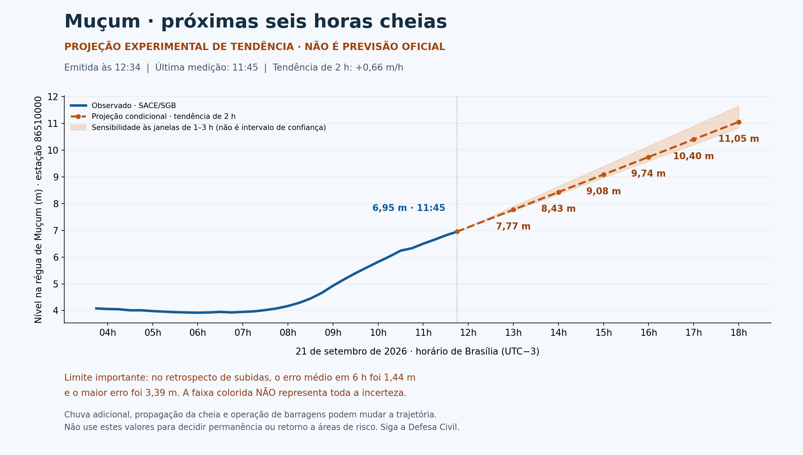

> **ANÁLISE SUPERADA — NÃO USAR COMO PREVISÃO PÚBLICA.** A avaliação posterior identificou falha importante de previsão. Consulte [a análise completa da bacia](../mucum-bacia-2026-09-21/relatorio.md).

# Muçum — projeção condicional de nível

Emissão: 21/09/2026 12:34 (Brasília). Última observação oficial recuperada: **6,95 m às 11:45**, estação SACE 86510000.

| Horário de Brasília | Projeção de tendência | Sensibilidade 1–3 h* |
|---|---:|---:|
| 13:00 | 7,77 m | 7,73–7,89 m |
| 14:00 | 8,43 m | 8,35–8,64 m |
| 15:00 | 9,08 m | 8,97–9,39 m |
| 16:00 | 9,74 m | 9,59–10,15 m |
| 17:00 | 10,40 m | 10,21–10,90 m |
| 18:00 | 11,05 m | 10,83–11,65 m |

*Esta faixa compara somente três extrapolações lineares. Não é intervalo de confiança, limite mínimo/máximo do rio nem limite seguro. Os valores são condicionais à continuidade da tendência; não identificam o pico da cheia. Duas casas decimais servem para reproduzir a conta, não representam precisão real.

## Método e limites

Regressão linear nos nove registros de 15 minutos das últimas duas horas, ancorada na última leitura observada, sem suavizar essa observação. A fórmula é `nível = último nível + taxa × horas desde a última medição`. As duas janelas auxiliares usam 5 e 13 registros. Os seis horários são as próximas seis horas cheias após a emissão, portanto o horizonte desde a medição é maior que seis horas no último ponto. Não misturamos réguas ou cotas altimétricas de outras estações.

Taxas: 1 h = 0,62; 2 h = 0,66; 3 h = 0,75 m/h.

Cheque retrospectivo causal no histórico disponível desde 21/08/2026: origens em horas cheias, subida estimada ≥0,20 m/h, sem observações futuras no cálculo. Os casos se sobrepõem e não são eventos independentes; este teste não valida uso operacional nem cobertura probabilística. Em 6 h: 52 casos, erro médio absoluto 1,44 m e maior erro 3,39 m. O último horário solicitado vai além deste horizonte de teste.

## Chuva recuperada do HAR e atualizada

O HAR revelou `/produtos/cemaden/2026-09-21/1200.txt` (catálogo) e `/produtos/stations/2026-09-21/17718.txt` (histórico de Muçum). Foram feitas novas requisições GET com os cabeçalhos públicos de navegador/referência da captura, sem cookies ou tokens. O acesso inicial sem esses cabeçalhos retornou 403; os arquivos de dados foram depois obtidos com HTTP 200.

Consultados **24 pluviômetros CEMADEN**, dos quais **20** passaram na consistência interna. Seleção regional de municípios na região contribuinte e entorno; não é delimitação geográfica rigorosa de sub-bacia e não produz média areal. Nenhum total foi somado entre estações.

O acumulado mostrado é a diferença entre a primeira e a última leitura diária (coluna de índice 21, base zero), conferida pela soma dos incrementos (índice 43). A janela exata e os valores ausentes/inconsistentes estão no CSV. A interpretação foi verificada por consistência das séries, não por documentação oficial de esquema do SIGMA. Sensores com acumulados negativos, reinícios ou divergência entre incrementos e acumulado foram excluídos do resumo, nunca convertidos em zero de chuva. Valores altos consistentes ainda não são homologação de qualidade física do sensor.

| Estação | Janela | Chuva no período |
|---|---|---:|
| CEMADEN - Santa Tereza - G2-431725101A (244 m) (16927) | 00:10–12:20 | 162.8 mm |
| CEMADEN - Santa Tereza - G2-431725102A (81 m) (16935) | 00:20–12:20 | 155.2 mm |
| CEMADEN - Flores da Cunha - G2-430820103A (717 m) (16913) | 00:10–12:10 | 149.4 mm |
| CEMADEN - Muçum - G2-431260902A (136 m) (17718) | 00:10–12:20 | 139.0 mm |
| CEMADEN - Bento Gonçalves - FUNDAPARQUE (617 m) (17559) | 00:10–12:20 | 135.0 mm |
| CEMADEN - Bento Gonçalves - G2-Caminhos de Pedra - São pedro (513 m) (16917) | 00:10–12:20 | 134.8 mm |
| CEMADEN - Bento Gonçalves - EMBRAPA UVA (626 m) (17560) | 00:10–12:20 | 130.8 mm |
| CEMADEN - Bento Gonçalves - Faria Lemos (349 m) (17561) | 00:10–12:20 | 127.2 mm |
| CEMADEN - Muçum - G2-431260903A (60 m) (17717) | 00:10–12:30 | 123.4 mm |
| CEMADEN - Flores da Cunha - G2-430820102A (744 m) (16912) | 00:10–12:00 | 122.8 mm |
| CEMADEN - Guaporé - G2-430940701A (473 m) (16952) | 00:10–12:30 | 120.2 mm |
| CEMADEN - Bento Gonçalves - Tuiuty (315 m) (17558) | 00:10–12:20 | 115.0 mm |
| CEMADEN - Veranópolis - G2-432280603A (663 m) (16931) | 00:10–12:20 | 112.4 mm |
| CEMADEN - Flores da Cunha - G2-430820101A (721 m) (16920) | 00:00–12:30 | 103.0 mm |
| CEMADEN - Veranópolis - G2-432280601A (605 m) (16940) | 00:10–12:20 | 98.8 mm |
| CEMADEN - Veranópolis - G2-432280602A (664 m) (16930) | 00:10–12:00 | 95.8 mm |
| CEMADEN - Santa Tereza - G2-431725103A (479 m) (16936) | 00:10–12:20 | 59.4 mm |
| CEMADEN - Vacaria - Vila São João (975 m) (7379) | 00:40–12:30 | 12.4 mm |
| CEMADEN - Vacaria - Centro (941 m) (7377) | 00:20–12:20 | 9.6 mm |
| CEMADEN - Antônio Prado - G2-430080203A (685 m) (16922) | 00:10–12:10 | 0.2 mm |

**A chuva e as estações a montante foram usadas como contexto de risco e verificação da subida; não receberam um coeficiente artificial de conversão de milímetros para metros.** Faltam modelo chuva–vazão–cota calibrado, tempos de trânsito validados, previsão quantitativa de chuva e operação de barragens para uma previsão hidrológica quantitativa completa. A extrapolação pode errar para cima ou para baixo.

## Montante — cada nível em sua própria régua

- Santa Tereza: 6,33 m às 11:45, variação de +0,42 m em uma hora.
- Linha José Júlio: 6,92 m às 11:30, variação de +0,02 m em uma hora.
- Linha Colombo / Guaporé: 2,30 m às 11:45, variação de +0,40 m em uma hora.
- Passo Carreiro: 3,34 m às 11:30, variação de +0,58 m em uma hora.

## Fontes e segurança

- [Medições SACE/SGB de Muçum](https://sace.sgb.gov.br/api/dados/taquari_3_cota.csv).
- [Histórico pluviométrico SIGMA/CEMADEN de Muçum](https://sigmameteorologia.com/produtos/stations/2026-09-21/17718.txt). Demais URLs no CSV de pluviômetros.
- [Descrição oficial do sistema de alerta Taquari](https://www.sgb.gov.br/sace/taquari_apresentacao.php): o SGB descreve antecipação aproximada de quatro horas para Muçum, diferente desta extrapolação experimental de seis horários.
- [Boletins SACE](https://www.sgb.gov.br/sace/boletins.php?idbacia=9): a página recuperada nesta análise tinha como mais recente 14/08/2026 às 22h; não foi tratada como previsão de hoje.
- [Alertas da Defesa Civil RS](https://www.defesacivil.rs.gov.br/avisos-e-alertas).

Não foi emitida previsão de pico nem conclusão de ausência de inundação. Não use este gráfico como critério de permanência/retorno ou para aguardar uma cota antes de atender a uma ordem de evacuação. Em emergência, Defesa Civil 199 / Bombeiros 193.

Arquivos: `projecao.csv`, `pluviometros.csv`, `montante.csv`, `checagem-retrospectiva.csv`, `resultado.json`, gráfico PNG/SVG e respostas de origem em `raw/`. A captura HAR original não foi copiada para a saída; apenas corpos de dados meteorológicos públicos foram extraídos. Nenhuma publicação, deploy, alerta ou mensagem externa foi executado.
